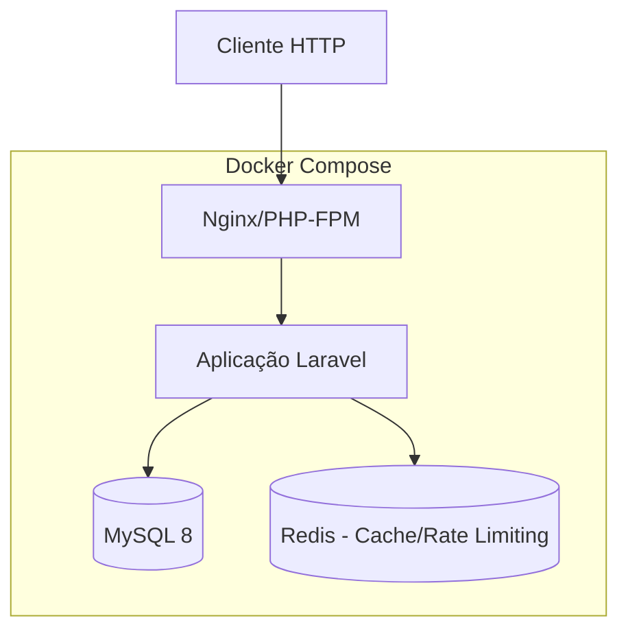
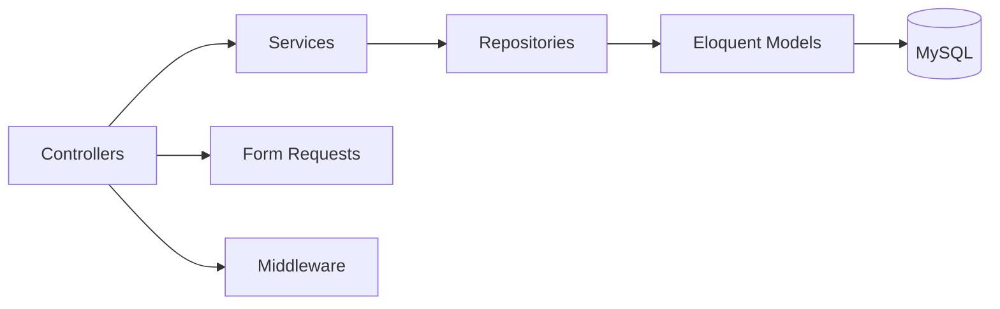
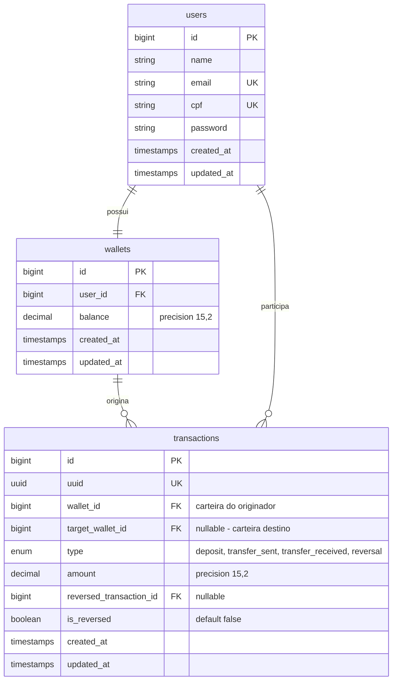

# Documento de Design — Carteira Financeira

## Visão Geral

Este documento descreve o design técnico da aplicação de carteira financeira digital construída com PHP/Laravel. A aplicação provê operações de cadastro, autenticação JWT, depósitos, transferências entre usuários e reversão de operações, com foco em integridade financeira garantida por transações atômicas no banco de dados.

A aplicação é containerizada com Docker e utiliza MySQL como banco de dados relacional. O design prioriza segurança (bcrypt, JWT, rate limiting), corretude (transações atômicas, propriedades verificáveis) e observabilidade (logs estruturados).

## Arquitetura

### Visão de Alto Nível



### Camadas da Aplicação



1. **Controllers**: Recebem requisições HTTP, delegam para Services, retornam respostas JSON.
2. **Services**: Contêm lógica de negócio (transferências, depósitos, reversões). Gerenciam transações de banco.
3. **Repositories** (opcional via Eloquent): Acesso a dados encapsulado nos Models.
4. **Middleware**: Autenticação JWT, rate limiting, validação de entrada.
5. **Form Requests**: Validação declarativa de dados de entrada.

### Decisões de Arquitetura

| Decisão | Justificativa |
|---------|---------------|
| Eloquent ORM direto (sem Repository Pattern separado) | Projeto de escopo médio; Eloquent já fornece abstração suficiente |
| Services para operações financeiras | Isolar lógica atômica de transações e regras de negócio |
| JWT via `tymon/jwt-auth` | Padrão maduro para APIs stateless em Laravel |
| Rate limiting via middleware Laravel | Integração nativa com Redis, configurável por rota |
| Logs estruturados via Monolog/JSON | Padrão Laravel, fácil integração com ferramentas de observabilidade |

## Componentes e Interfaces

### API REST — Endpoints

| Método | Rota | Descrição | Auth |
|--------|------|-----------|------|
| POST | `/api/register` | Cadastro de usuário | Não |
| POST | `/api/login` | Autenticação | Não |
| POST | `/api/logout` | Logout (invalidar token) | Sim |
| GET | `/api/wallet/balance` | Consulta de saldo | Sim |
| GET | `/api/wallet/statement` | Extrato de transações | Sim |
| POST | `/api/wallet/deposit` | Realizar depósito | Sim |
| POST | `/api/wallet/transfer` | Realizar transferência | Sim |
| POST | `/api/wallet/reverse/{transaction_id}` | Reverter transação | Sim |

### Services

#### AuthService
```php
interface AuthService {
    public function register(array $data): User;
    public function login(string $email, string $password): string; // retorna JWT
    public function logout(): void;
}
```

#### WalletService
```php
interface WalletService {
    public function getBalance(User $user): float;
    public function getStatement(User $user): Collection;
    public function deposit(User $user, float $amount): Transaction;
    public function transfer(User $sender, User $receiver, float $amount): Transaction;
    public function reverse(User $user, Transaction $transaction): Transaction;
}
```

### Middleware

- **JwtAuthMiddleware**: Valida token JWT em rotas protegidas.
- **RateLimitMiddleware**: Aplica rate limiting (ex: 60 req/min para operações, 5 req/min para login).
- **ValidateInputMiddleware**: Sanitização de dados via Form Requests do Laravel.

## Modelos de Dados

### Diagrama ER



### Detalhes dos Modelos

#### User
| Campo | Tipo | Restrições |
|-------|------|------------|
| id | bigint | PK, auto-increment |
| name | string(255) | required |
| email | string(255) | required, unique |
| cpf | string(11) | required, unique |
| password | string(255) | required, bcrypt hash |
| created_at | timestamp | auto |
| updated_at | timestamp | auto |

#### Wallet
| Campo | Tipo | Restrições |
|-------|------|------------|
| id | bigint | PK, auto-increment |
| user_id | bigint | FK → users.id, unique |
| balance | decimal(15,2) | default 0.00 |
| created_at | timestamp | auto |
| updated_at | timestamp | auto |

#### Transaction
| Campo | Tipo | Restrições |
|-------|------|------------|
| id | bigint | PK, auto-increment |
| uuid | uuid | unique, para referência pública |
| wallet_id | bigint | FK → wallets.id |
| target_wallet_id | bigint | nullable, FK → wallets.id |
| type | enum | deposit, transfer_sent, transfer_received, reversal |
| amount | decimal(15,2) | valor da operação |
| reversed_transaction_id | bigint | nullable, FK → transactions.id |
| is_reversed | boolean | default false |
| created_at | timestamp | auto |
| updated_at | timestamp | auto |

### Índices

- `users.email` — unique index
- `users.cpf` — unique index
- `wallets.user_id` — unique index
- `transactions.wallet_id` — index para consulta de extrato
- `transactions.uuid` — unique index para referência pública
- `transactions.reversed_transaction_id` — index para verificação de reversão

